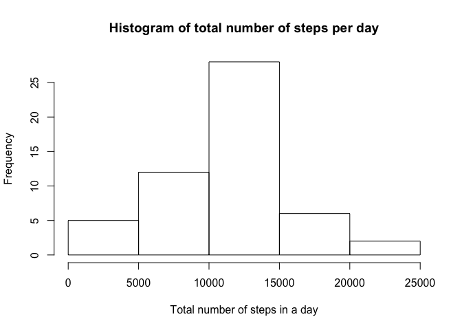
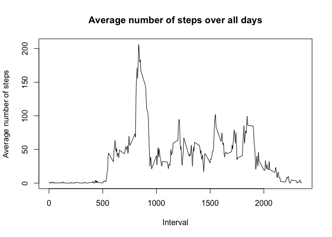
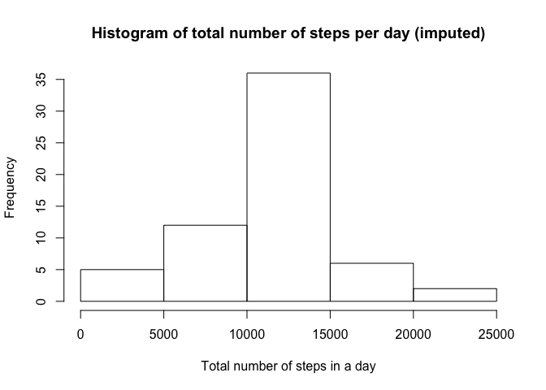
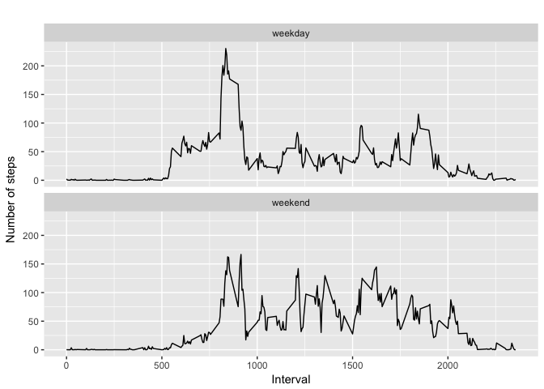

# Reproducible Research: Peer Assessment 1
Barbara  
2/12/2017  

## Loading and preprocessing the data

1. We begin by creating a directory for the data (in the current working directory path), downloading the data activity package from the provided URL and unzipping the archive.

```r
dir.create("data") 
download.file("http://d396qusza40orc.cloudfront.net/repdata/data/activity.zip", destfile="data/data_activity.zip")
unzip("data/data_activity.zip", exdir="data")
```

2. Then, we read the data from the .csv file and store it in a memory variable named (how original!) "data".


```r
  data <- read.csv('data/activity.csv')
  dim(data)
```

```
## [1] 17568     3
```

3. Finally, we then process the data into a format suitable for our analysis. In particular, we create a new data set excluding records that contain NA.


```r
subdata = data[!is.na(data$steps), ]  
dim(subdata)
```

```
## [1] 15264     3
```

## What is mean total number of steps taken per day?
For this part of the assignment, you can ignore the missing values in the dataset.

1.- Calculate the total number of steps taken per day

2.- If you do not understand the difference between a histogram and a barplot, research the difference between them. Make a histogram of the total number of steps taken each day

3.- Calculate and report the mean and median of the total number of steps taken per day


```r
#group data per day
num.steps.day <- aggregate(subdata$steps, list(subdata$date), sum)
colnames(num.steps.day) <- c("date", "steps")

library(ggplot2)
#hist
hist(num.steps.day$steps, main="Histogram of total number of steps per day", 
     xlab="Total number of steps in a day")
```

<!-- -->

```r
#mean and median
steps_mean   <- mean(num.steps.day$steps)
steps_median <- median(num.steps.day$steps)
```
Now, we print the value for the mean number of steps per day

```r
#print mean
steps_mean
```

```
## [1] 10766.19
```
and for the median number of steps per day

```r
#print median
steps_median
```

```
## [1] 10765
```

## What is the average daily activity pattern?
1. Make a time series plot (i.e. type = "l") of the 5-minute interval (x-axis) and the average number of steps taken, averaged across all days (y-axis)

2. Which 5-minute interval, on average across all the days in the dataset, contains the maximum number of steps?


```r
# preprocessing data for plot
steps_by_interval <- aggregate(steps ~ interval, subdata, mean)

# create a time series plot 
plot(steps_by_interval$interval, steps_by_interval$steps, type='l', 
     main="Average number of steps over all days", xlab="Interval", 
     ylab="Average number of steps")
```

<!-- -->


```r
# find row with max of steps
max_steps_row <- which.max(steps_by_interval$steps)

# find interval with this max
steps_by_interval[max_steps_row, ]
```

```
##     interval    steps
## 104      835 206.1698
```

We find that interval 835 has the maximum average value of steps (206.1698). 


## Imputing missing values
Note that there are a number of days/intervals where there are missing values (coded as NA). The presence of missing days may introduce bias into some calculations or summaries of the data.

1. Calculate and report the total number of missing values in the dataset (i.e. the total number of rows with NAs)


```r
sum(is.na(data))
```

```
## [1] 2304
```
We find that the total number of NA values is 2304

2. Devise a strategy for filling in all of the missing values in the dataset. The strategy does not need to be sophisticated. For example, you could use the mean/median for that day, or the mean for that 5-minute interval, etc.
3. Create a new dataset that is equal to the original dataset but with the missing data filled in.

We now fill in the missing values with the value of the mean of that 5-minute interval, and we do it by creating the "data_imputed" dataset


```r
data_imputed <- data
  for (i in 1:nrow(data_imputed)) {
     if (is.na(data_imputed$steps[i])) {
        interval_value <- data_imputed$interval[i]
        steps_value <- steps_by_interval[
        steps_by_interval$interval == interval_value,]
        data_imputed$steps[i] <- steps_value$steps
      }
  }
```


4. Make a histogram of the total number of steps taken each day and calculate and report the mean and median total number of steps taken per day. Do these values differ from the estimates from the first part of the assignment? What is the impact of imputing missing data on the estimates of the total daily number of steps?

We first calculate the total number of set taken each day and look at the head of the data

```r
# total number of steps taken each day
imputed_steps_by_day <- aggregate(steps ~ date, data_imputed, sum)
head(imputed_steps_by_day)
```

```
##         date    steps
## 1 2012-10-01 10766.19
## 2 2012-10-02   126.00
## 3 2012-10-03 11352.00
## 4 2012-10-04 12116.00
## 5 2012-10-05 13294.00
## 6 2012-10-06 15420.00
```
and then plot the histogram of the imputed dataset

```r
hist(imputed_steps_by_day$steps, main="Histogram of total number of steps per day (imputed)", 
     xlab="Total number of steps in a day")
```

<!-- -->


Finally, we compare the mean and median values of the imputed dataset with the initial dataset.

```r
# mean and median of imputed data
imputed.steps.mean <- mean(imputed_steps_by_day$steps)
imputed.steps.median <- median(imputed_steps_by_day$steps)
```
The mean number of steps per day in the imputed dataset is

```r
imputed.steps.mean
```

```
## [1] 10766.19
```
while for the original data set was

```r
steps_mean
```

```
## [1] 10766.19
```
The median number of steps per day in the imputed dataset is

```r
imputed.steps.median
```

```
## [1] 10766.19
```
while for the original data set was

```r
steps_median
```

```
## [1] 10765
```
There is only a slight difference in the median values.

## Are there differences in activity patterns between weekdays and weekends?

For this part the weekdays() function may be of some help here. Use the dataset with the filled-in missing values for this part.

Create a new factor variable in the dataset with two levels ??? ???weekday??? and ???weekend??? indicating whether a given date is a weekday or weekend day.

Make a panel plot containing a time series plot (i.e. type = ???l???) of the 5-minute interval (x-axis) and the average number of steps taken, averaged across all weekday days or weekend days (y-axis). See the README file in the GitHub repository to see an example of what this plot should look like using simulated data.


```r
data_imputed['type_of_day'] <- weekdays(as.Date(data_imputed$date))
data_imputed$type_of_day[data_imputed$type_of_day  %in% c('Saturday','Sunday') ] <- "weekend"
data_imputed$type_of_day[data_imputed$type_of_day != "weekend"] <- "weekday"

# convert type_of_day from character to factor
data_imputed$type_of_day <- as.factor(data_imputed$type_of_day)

# calculate average steps by interval across all days
imputed_steps_by_interval <- aggregate(steps ~ interval + type_of_day, data_imputed, mean)

# creat the plot
qplot(interval, 
      steps, 
      data = imputed_steps_by_interval, 
      geom=c("line"),
      xlab = "Interval", 
      ylab = "Number of steps", 
      main = "") +
  facet_wrap(~ type_of_day, ncol = 1)
```

<!-- -->
